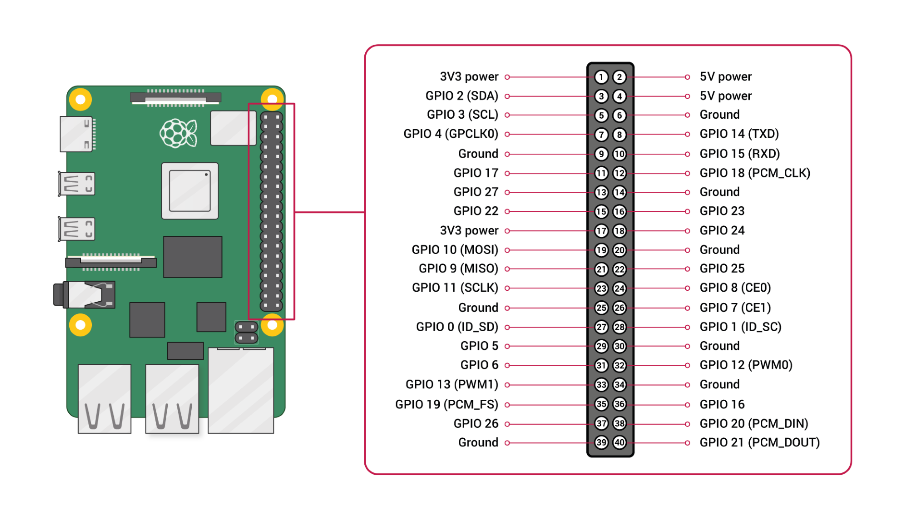
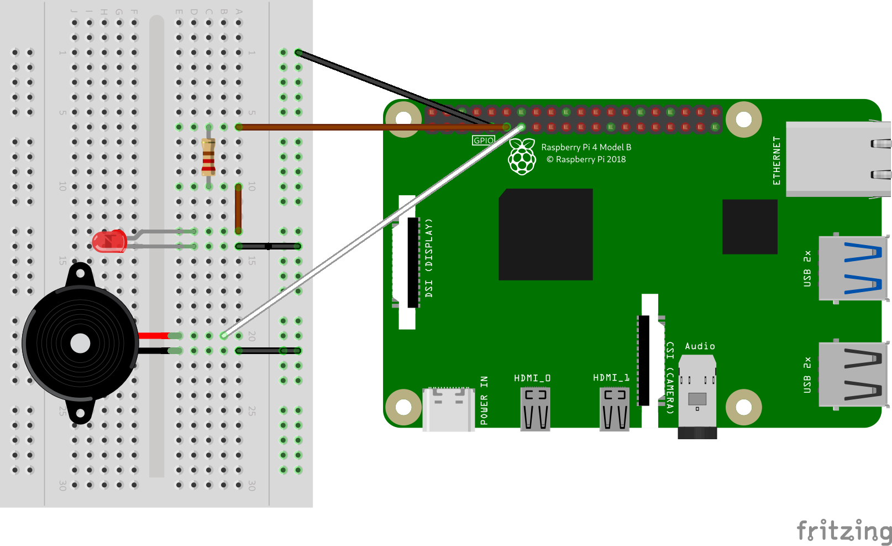
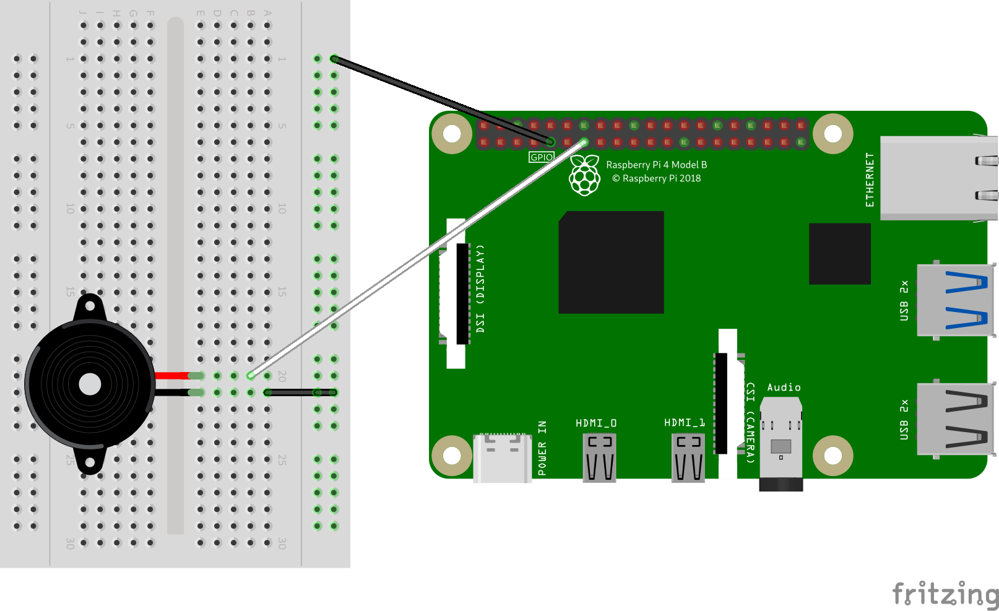

[Retornar a Tabela de Conteúdos](./)
# Introdução a GPIO

Neste diretório se encontram os códigos utilizados nas práticas sobre portas GPIO (<i>General Purpose Input-Output</i> Entrada e Saída de uso geral) da Raspberry PI. Todas as práticas são realizadas utilizando Raspberry PI modelo 4B e todos os scritps foram escritos em Python 3. A relação segue abaixo:
*   [requeriments](requeriments.txt) - Dependências Python necessárias para executar os scripts
*   [gpio_led_buzzer](gpio_led_buzzer.py) - Script que aciona um led/buzzer
*   [buzzer](buzzer.py) -  Script que toca o tema clássico do jogo de videogame do Super Mario.
*   [check_requisitos](check_requisitos.py) - Verifica se as bibliotecas necessárias a execução dos scripts se encontram instaladas

## Descrição dos scripts
Para entender todos os scripts, é importante conhecer o esquema <i>pinout</i> GPIO da Raspberry PI. Cortesia da imagem: [Raspberry PI Foundation](https://www.raspberrypi.org/)


### gpio_led_buzzer

Script que aciona um LED e um buzzer por cinco segundos, cada um. A imagem a seguir demonstra como o protótipo deve ser feito para executar o código. 


Para exercutar o código:
```
$ python3 gpio_led_buzzer.py 
```

### buzzer.py
Script que toca o tema do Super Mario, dos antigos jogos de videogame da Nintendo. A imagem a seguir demonstra como o protótipo deve ser feito para executar o código. 

Para exercutar o código:
```
$ python3 buzzer.py 
```

## ✔️ Técnicas e tecnologias utilizadas

- ``Python 3``
- ``Visual Studio Code``
