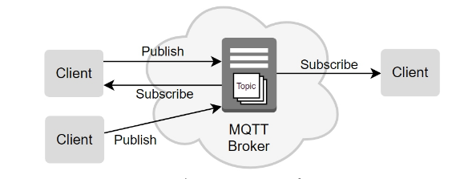

[Retornar a Tabela de Conteúdos](./)
# MQTT
O MQTT (<i>Message Queuing Telemetry Transport</i>) é um protocolo de transporte de mensagens que segue o modelo Cliente/Servidor e que possibilita a comunicação entre máquinas (<i>Machine to Machine</i> – M2M), sendo amplamente utilizado para conectividade em IoT. É aberto, leve e de fácil implementação, sendo executado em TCP/IP ou em outros protocolos.

Em sistemas MQTT, o paradigma (ou conceito) ```Publish/Subscribe``` é empregado. Nele, o cliente pode fazer “postagens/publicações” ou captar informações, enquanto o Servidor administra o envio e o recebimento desses dados. O objetivo da existência deste protocolo é minimizar a largura de banda da rede e os requisitos sobre recursos de dispositivos restritos, proporcionando confiabilidade e maior garantia de entrega.


## Ecossistema MQTT
Todo o ecossistema do MQTT depende, fundamentalmente, dos seguintes elementos:

##### Publish/subscribe (Publicação/Assinatura)

Quando um dispositivo é do tipo ```publish```, significa que este faz publicações de dados ou comandos pré-definidos. Já os dispositivos ```subscribe``` **assinam** um tópico e recebem as informações publicadas pelo publicador.

Esse padrão de comunicação separa o cliente que publica do cliente que recebe. Isso significa que eles não mantêm contato direto e nem ao menos precisam saber que da existência do outro, já que as mensagens são enviadas por um Broker.

##### Broker

Desempenha um papel fundamental no processo de publicação/assinatura: o de "servidor intermediário".

Tem o papel de filtrar todas as mensagens, recebendo-as, enfileirando-as e distribuindo-as para cada assinante, que irá receber somente as mensagens de seu interesse (ou seja, aquelas que foram assinadas por ele).

Essa filtragem pode ser realizada de diferentes formas, como aquelas baseada em um assunto ou tópico, conteúdo, tipo ou classe.

Um sistema pode conter mais de um Broker, que fazem compartilhamento dos dados entre si, para direcionar as mensagens aos clientes.

Existem alguns *brokers* públicos na Internet. Um dos mais conhecidos de todos é o [mosquitto](https://mosquitto.org/).

##### Cliente
Pode ser um sensor em campo, um aplicativo em um data center ou qualquer coisa que seja capaz de interagir com o Broker e receber informações.

Atua postando (Publish), recebendo (Subscriber) ou fazendo as duas coisas ao mesmo tempo, sempre necessitando de um Broker para a intermediação das mensagens.

##### Tópico
A identificação das mensagens no MQTT se dá através de tópicos. O tópico lembra o conceito de URI, com níveis separados por barras (“/”). Elementos da rede podem enviar diversos tópicos para o broker e subscritores podem escolher os tópicos que desejam subscrever.

Por exemplo, imagine que, em uma rede de sensores, existam vários sensores diferentes de temperatura e umidade, publicando o valor do sensor e identificando as mensagens com tópicos nos seguintes formatos:

``` 
area/ID_da_area/sensor/ID_do_sensor/temperatura
area/ID_da_area/sensor/ID_do_sensor/umidade
```

Neste esquema, possíveis publicações seriam: 

```
area/10/sensor/5000/temperatura
area/10/sensor/5000/umidade
area/10/sensor/5001/temperatura
area/10/sensor/5001/umidade
area/20/sensor/4000/temperatura
area/20/sensor/4000/umidade
area/20/sensor/4001/temperatura
area/20/sensor/4001/umidade
```

## Como funciona
Como mencionado, o protocolo MQTT utiliza o paradigma ```Publish/Subscribe```, onde uma máquina <strong>publica</strong> uma mensagem em um <strong>tópico</strong> e todas as outras máquinas que <strong>assinam</strong> aquele tópico, recebem esta mensagem. Quem faz a gestão das mensagem é um <strong><i>broker</i></strong>, que nada mais é que um servidor das mensagens MQTT. A figura a seguir exemplifica como o protocolo funciona:



Um exemplo da utilização do MQTT pode ser uma aplicação que controla um reservatório de água:
- Um cliente MQTT pode ser um sensor de nível de água do reservatório, que assume o papel de <strong>"publicador"</strong>, informando a todas as máquinas interessadas o nível corrente de água.

- Uma bomba de água pode assumir o papel de <strong>"publicador"</strong> e <strong>assinante</strong>:

    * Como assinante, pois pode receber mensagens (via inscrição) para bombear água ou parar
    * Como publicador, indicando seu status (se está bombeando água ou não)

- A aplicação controladora, onde toda a lógica de negócios reside, também assume ambos os papéis:

    * Como pubilicadora, que pode enviar mensagens para a bomba ligar ou desligar.
    * Como assinante, recebendo informações tanto do nível de água do reservatório e do status da bomba.
