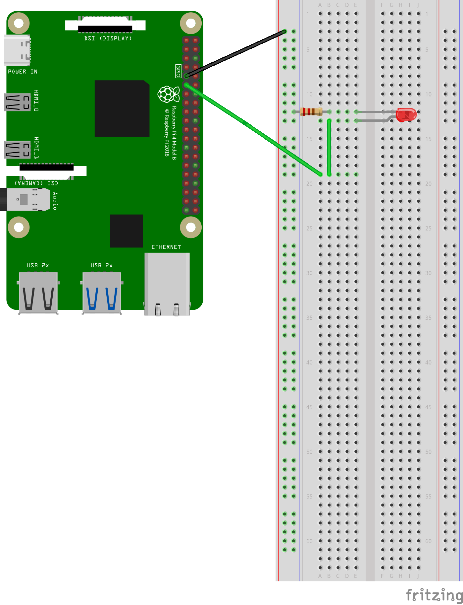

[Retornar a Tabela de Conteúdos](./)
# REST
Presente desde o início dos anos 90, o protocolo HTTP é atualmente o principal protocolo utilizado para comunicação entre sistemas Web.

Nos anos 2000, Roy Fielding, um dos principais autores deste protocolo, sugeriu o uso de novos métodos. Estes métodos pretendiam resolver problemas relacionados a semântica durante as requisições. As sugestões permitiram o uso do HTTP de uma forma muito aproximada da utilização atual, dando sentido às requisições. Para melhor percepção, segue os exemplos da proposta de Fielding:
1. ```GET``` http://www.meudominio.com/alunos
2. ```DELETE``` http://www.meudominio.com/alunos/patrick
3. ```POST``` http://www.meudominio.com/alunos –data {nome: Marcus}

No exemplo 1, utilizamos o método (ou verbo) ```GET``` para obter todos os **recursos** daquela página (no exemplo, a página ```http://www.meudominio.com/alunos```). Entenda recurso como algo que uma determinada página pode oferecer (conteúdo HTML, documento PDF, arquivos de formatação, etc). Já no segundo exemplo, o verbo ```DELETE``` é utilizado para para remover um recurso da mesma página. No exemplo, é solicitado a remoção de um aluno de nome *patrick*. Já o método ```POST```, do terceiro exemplo, demonstra a criação de um novo aluno na base de dados do servidor ```www.meudominio.com```.

Os princípios apresentados fazem parte da API (*Application Programing Interface* - Interface de Programação de Aplicação) REST (*Representational State Transfer* - Transferência de estado representacional). A REST (ou RESTFul) é uma arquitetura de software que impõe condições sobre como uma API deve funcionar. Ou seja, a API concede a **interoperabilidade** entre usuários e aplicações.


Em suma, os principais verbos HTTP utilizados nas API REST são (se quiser conhecer sobre todos os métodos, leia mais [aqui](https://developer.mozilla.org/pt-BR/docs/Web/HTTP/Methods)):

| Método/Verbo HTTP| Descrição |
| -------- | ------- |
| GET | Obtém um recurso |
| POST | Adiciona um novo recurso |
|PUT | Atualiza um recurso |
|DELETE | Remove um recurso |
|PATCH | Parcialmente atualiza um recurso em uma coleção |

## Representações
Sabemos que uma API perimite com que sistemas sejam  interoperáveis. É importante que o intercâmbio de mensagens seja padronizado e se possível, facilmente compreendido por máquinas e humanos. Vamos analisar três exemplos muito utilizados nas API's:

* Mensagem em XML:
```xml
<endereco>
   <cep>156112-651</cep>
   <cidade>Belo Horizonte</cidade>
   <numero>126</numero>
   <rua>Avenida Amazonas</rua>
</endereco>
```
* Mensagens em JSON:
```json
{
  "endereco" : {
    "rua" : "Avenida Amazonas",
    "numero" : "126",
    "cidade" : "Belo Horizonte",
    "cep": "156112-651" 
  }
}
```
* Mensagens em YAML:
```yaml
endereco:
  rua: 'Avenida Amazonas'
  numero: '126'
  cidade: 'Belo Horizonte'
  cep: '156112-651'
```

## HTTP e IoT
Em diversas situações, HTTP não é o protocolo ideal para aplicações IoT. A latência não é previsível. Além do mais, é um protocolo baseado em texto, o que pode tornar o tamanho das mensagens muito grande (isso pode exigir grande consumo de energia por parte dos dispositivos). No entanto, o protocolo já é maduro o suficiente para ter vasto uso. O protocolo também atua sob TCP (entrega confiável).

Algumas vantagens no emprego do HTTP para IoT:
* Confiável: Entrega da mensagem é garantida
* Onipresença: HTTP é usado em diversos cenários e é facilmente implementado
* Fácil de ser implementado: Se você se conecta à Internet, é possível usaro HTTP em qualquer lugar do mundo (não há necessidade de software ou hardware adcional).

Algumas desvantagens no emprego do HTTP para IoT:
* Consumo alto de carga: o processo de "ir e voltar" na comunicação é comum para manter as conexões, o que faz o consumo de energia ser maior. O tamanho das mensagens também é um dificultador.
* Complexidade dos dispositivos IoT: dispositivos IoT são muito heterogêneos, o que significa que nem todos podem possuir memória e CPU suficientes para suportar o HTTP e uma API REST


# Práticas com REST
Neste diretório, se encontram os códigos utilizados nas práticas sobre o uso de REST API. Todos os scritps foram escritos em Python 3. A relação segue abaixo:
* [Criando uma API REST com Flask](rest.py)
* [Ligando/Desligando um LED com API REST](led_rest.py)
* [Alterando a intensidade de brilho de um LED utilizando API REST com PWM](server_pwm.py)

## Preparando o ambiente
**IMPORTANTE:** Antes de rodar os scripts, é necessário resolver as dependências dos projetos. O primeiro passo é criar um [ambiente virtual](https://docs.python.org/pt-br/3/library/venv.html) <strong>para cada projeto que iremos executar</strong>. Fazendo isso, podemos usar diferentes versões de uma biblioteca para um projeto em especifico, sem existir a necessidade de instalar elas em nosso Sistema Operacional (as bibliotecas são instaladas no diretório do seu projeto e só ficam disponíveis para ele). Para criar um ambiente virtual em Python:

```
$ python3 -m venv /diretório/para/ambiente_virtual
```

Após criar o ambiente virtual, precisamos ativá-lo:


```
$ source /diretório/para/ambiente_virtual/bin/activate
```

E finalmente podemos instalar nossas dependências (o comando a seguir deve ser executado dentro do diretório de seu projeto):

```
$ pip3 install -r requeriments.txt 
```

Para desativar (sair) do ambiente virtual de um projeto (para ativar outros, talvez), basta digitar:
```
$ deactivate
```
## Descrição dos scripts
Cada script visa explorar a utilização do protocolo WebSocket para facilitar a integração de aplicações Web com as 'coisas'. Utilizaremos o framework [Flask](https://flask.palletsprojects.com/), que permite com que possamos criar websockets de forma simples em Python. Também utilizaremos a biblioteca [Socket.io](https://socket.io/), que permite a comunicação bidirecional e em tempo real entre clientes e servidores da Web.

### [Criando uma API REST com Flask](rest.py)
<em>Script</em> que permite criar uma API com Flask, definindo os <em>endpoints</em> (ainda não aplicado ao uso de IoT). É necessário "estartar" o servidor com o seguinte comando:
```
$ python3 rest.py 
```
Você irá perceber que o servidor aguardará requisições na porta 5000 TCP (pode ser configurado/alterado). Feito isso, você pode utilizar algum software cliente para testar os <em>endpoints</em> da sua API (recomendo o plugin RESTED, disponível para Firefox e Google Chrome ou o [cURL](https://pt.wikipedia.org/wiki/CURL)). Analise o código para saber quais são os <em>endpoints</em> e crie/altere os <em>endpoints</em> já disponíveis. 

### [Ligando/Desligando um LED com API REST](led_rest.py)
Aqui, é possível ligar e desligar um LED utilizando a API que o código implementa. O protótipo para este exemplo pode ser visto na figura abaixo:



 É necessário "estartar" o servidor com o seguinte comando:
```
$ python3 rest.py 
```
Você irá perceber que o servidor aguardará requisições na porta 5000 TCP (pode ser configurado/alterado). Feito isso, você pode utilizar algum o navegador de sua preferência para ligar/desligar o LED ligado à GPIO, acessando ```http://<IP_DO_SERVIDOR>:5000```.

### [Alterando a intensidade de brilho de um LED utilizando API REST com PWM](server_pwm.py) - Créditos: Livro [Practical Python Programming for IoT](https://github.com/PacktPublishing/Practical-Python-Programming-for-IoT)

Você já aprendeu sobre [Modulação por Largura de Pulso (PWM)](https://github.com/mvscti/GTI04015-COMPUTACAO_EM_NUVEM_E_IOT_I/tree/main/WebSockets#modula%C3%A7%C3%A3o-por-largura-de-pulso-pwm). A ideia deste <em>script</em> é aplicar o mesmo conceito, mas desta vez, utilizando HTTP REST. Lembre-se que o circuito para este exemplo deve ser configurado [desta forma](https://raw.githubusercontent.com/mvscti/GTI04015-COMPUTACAO_EM_NUVEM_E_IOT_I/main/WebSockets/esquema.png).

