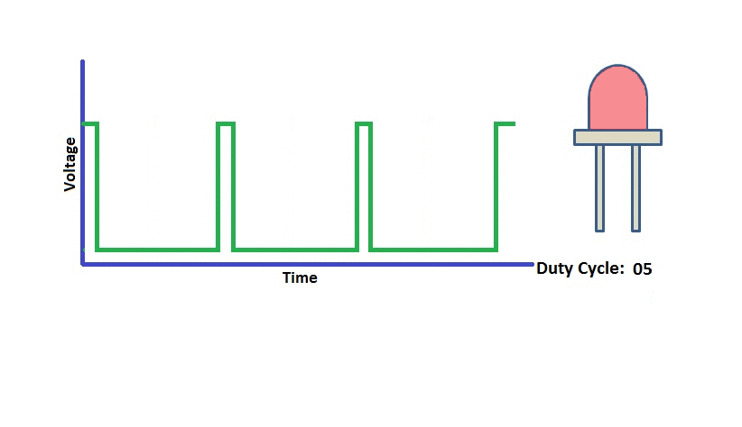
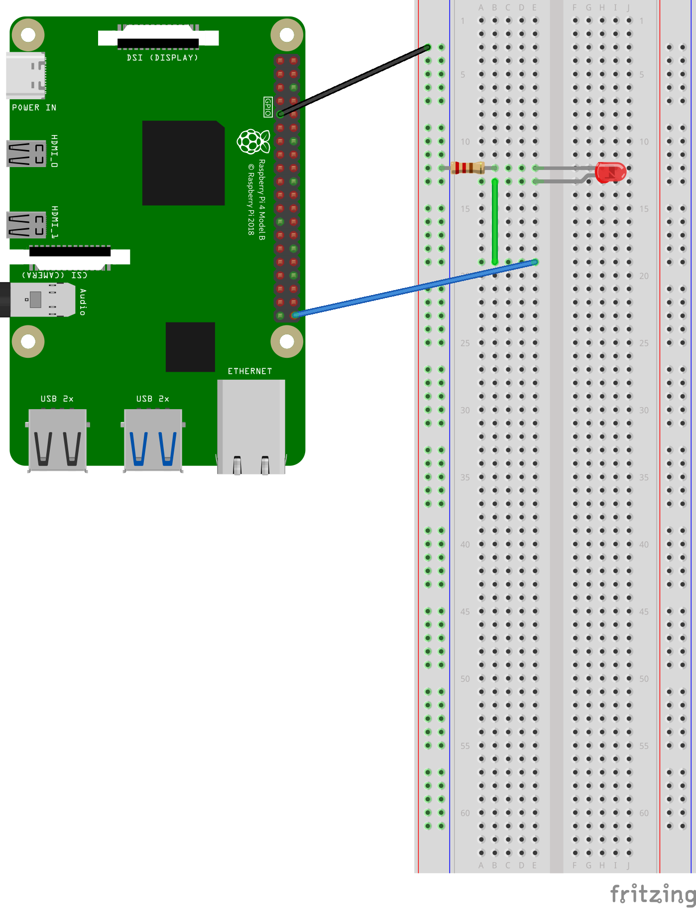

[Retornar a Tabela de Conteúdos](./)
# WebSockets
WebSocket é um protocolo que possibilita a criação de um canal de comunicação cliente-servidor (com transmissão bidirecional), permitindo que ambos os lados (cliente e servidor) possam transmitir dados simultaneamente. WebSocket supre as deficiências do protocolo HTTP (unidirecional) para esse objetivo. Ou seja, se o cliente envia 5 requisições HTTP para o servidor, 5 conexões TCP independentes são abertas, enquanto que com WebSocket uma única conexão TCP é aberta e ela fica disponível para troca de dados a qualquer momento (uma conexão persistente, até que um dos lados decida fechá-la).

É importante pontuar que Socket e WebSocket são coisas distintas: enquanto um WebSocket é um protocolo que funciona com sockets TCP, um Socket é uma abstração, uma porta lógica de comunicação entre duas pontas numa rede.

## Principais casos de uso para WebSockets

Em <i>Home Brokers</i> (onde cotações monetárias são atualizadas a todo instante), <i>feeds</i> de redes sociais, aplicativos de bate-papo, ferramentas de edição colaborativa, jogos multi-player, etc.

Em nosso caso, podemos utlizar esse protocolo para desenvolver soluções em IoT que vão desde simples acionamentos de LED's até aplicações complexas.

# Práticas com WebSocket
Neste diretório, se encontram os códigos utilizados nas práticas sobre o protocolo WebSocket. Todos os <em>scritps</em> foram escritos em Python 3. A relação segue abaixo:
*   [server_simples](simples/server.py) 
*   [client](simples/client.py) 
*   [server](Exemplo PWM)(server.py)


## Descrição dos scripts
<strong>IMPORTANTE:</strong> Antes de rodar os scripts, é necessário resolver as dependências:

```
$ python3 install -r requeriments.txt 
```

Cada script visa explorar a utilização do protocolo WebSocket para facilitar a integração de aplicações Web com as 'coisas'. Utilizaremos o framework [Flask](https://flask.palletsprojects.com/), que permite com que possamos criar websockets de forma simples em Python. Também utilizaremos a biblioteca [Socket.io](https://socket.io/), que permite a comunicação bidirecional e em tempo real entre clientes e servidores da Web.

### client e servidor_simples (Diretório `simples`)
<em>Scripts</em> que demonstram o uso de um servidor WebSocket com Flask (ainda não aplicado ao uso de IoT). Primeiro, é necessário "estartar" o servidor com o seguinte comando:
```
$ python3 server.py 
```
Você irá perceber que o servidor aguardará requisições na porta 5000 TCP (pode ser configurado/alterado). Feito isso, informe seu nome no arquivo `client.py` (na linha `4`) e execute o script em uma nova aba/janela com:
```
$ python3 client.py 
```
Você verá na "tela" de execução do script `server.py` que o nome informado por você no arquivo `client.py` aparecerá, como abaixo:

`Cliente <NOME> connectado..`, onde `<NOME>` é o nome definido por você. 

O cliente conecta, recebe uma mensagem do servidor e depois de cinco segundos, desconecta do servidor.


### server - Créditos [Livro "Pratical Python Programing for IoT](https://github.com/PacktPublishing/Practical-Python-Programming-for-IoT)
Este <em>script</em> demonstra como utilizar os conceitos de websocket para uma aplicação IoT que altera a intensidade de brilho de um LED de forma remota, através de uma página HTML (localizada no diretório `templates`), utilizando o <em>slider</em> para definir a intensidade do brilho.

<strong>Antes de executar este código, você deve se conectar à raspberry PI e executar o <em>daemon</em> `pigpiod`, da seguinte forma:</strong>
```
$ sudo pigpiod
```
Antes de executar o script, é necessário entender alguns conceitos sobre modulação por largura de pulso (mais conhecida pela sigla PWM, do inglês <i>Pulse-Width Modulation</i>). 

#### Modulação por Largura de Pulso (PWM)
Esta técnica de modulação gera uma onda quadrada, baseada na variação da largura de pulso de acordo com um valor chamado de <i>duty cycle</i>, definido pela seguinte fórmula:

$D=\frac{t_{on}}T_{s}$, onde:
- $D$ é o <i>duty cycle</i>
- $t_{on}$ é o tempo desligado do pulso
- $T_{s}$ é o tempo ligado do pulso
Resumidamente, o <i>duty cycle</i> é a razão entre o tempo ligado de um sinal PWM e o seu período.

PWM pode ser usado para codificar a informação para transmissão, permitir o controle da energia fornecida aos dispositivos elétricos (especialmente motores), reguladores de tensão, etc. Você pode saber mais a respeito de PWM [aqui](https://eltgeral.com.br/o-que-e-pwm/).

No nosso caso, iremos utilizar a raspberry PI para alterar a intensidade de um LED, conforme o exemplo da figura à seguir, que demonstra diferentes intensidades de brilho de um LED para diferentes valores de <i>duty cycles</i> (ou seja, quando o <i>duty cycle</i> é igual a 90%, por exemplo, existe entrega de potência em 90% do tempo....quando é 25%, existe entrega de potência em 25% do tempo e sucessivamente):


#### Circuito
Como você já conhece o [esquema da GPIO da raspberry PI](https://raw.githubusercontent.com/mvscti/GTI04015-COMPUTACAO_EM_NUVEM_E_IOT_I/main/GPIO/gpio-pinout-diagram.png), para que este <em>script</em> funcione da forma como queremos, temos que montar nosso circuito conforme o esquema à seguir:



Perceba que ligaremos o LED à porta GPIO 21 (não são todas as portas GPIO que permitem uso de PWM). Após nos certificar de que nosso circuto está montado corretamente, basta executar o script:
```
$ python3 server.py
```

Nossa aplicação cliente é uma página web que conecta ao servidor WebSocket. Para isso, basta acessar o navegador de sua preferência e informar a URL: `http://<IP>:5000`, onde `<IP>` é o endereço IP da raspberry PI.
